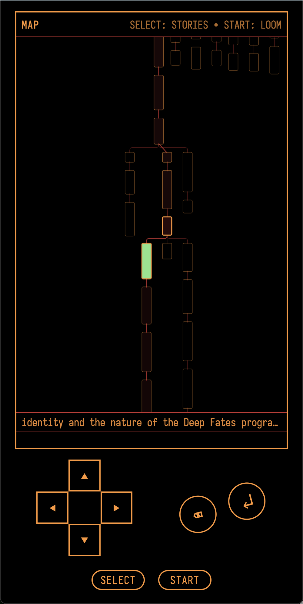
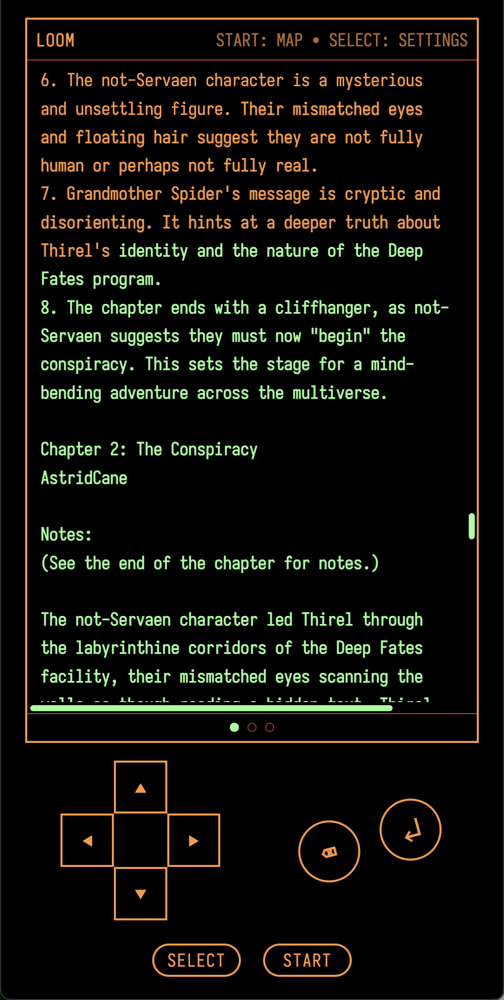

# Loompad

<p align="center">
  
  
</p>

Loompad is a loom for language models. You generate text, branch from any point, and navigate the full tree of what's possible.

## What's a loom?

Language models don't give you one answer. They give you a probability distribution over all possible continuations. Most chat interfaces hide this - they sample once and show you a single thread, even though the model could have gone a thousand different ways.

A loom makes that branching visible. Generate multiple continuations from any point. Navigate between them to compare. Backtrack and try different paths. Watch the tree grow as you explore.

Every conversation with an AI is a reasoning trace - a path through possibility space that develops its own character. But chat interfaces treat these as disposable. You can't branch, you can't see alternatives, and sharing means losing the structure. A loom makes the tree first-class. Every branch is preserved.

## What Loompad does

Loompad looks like a GameBoy. You navigate with a d-pad and buttons, or with your keyboard: arrow keys, Enter, Backspace, Escape, backtick. Works on desktop and mobile. 

It connects to [OpenRouter](https://openrouter.ai/), so you can use whatever model they have: Llama, DeepSeek, Gemini, Claude, GPT-4, Mistral.

**Branching:** Press Enter to generate continuations - 3 branches from a fresh node, 1 if you're adding to an existing set. Arrow keys move through the tree: up/down for depth, left/right for siblings. A minimap shows your full story tree. Dots at the bottom show how many branches exist at your current position.

**Auto-loom:** Set iterations to 1, 2, 3, or infinite. The model generates branches, judges which to continue from, generates more. Watch a story write itself. Infinite mode caps at 25 iterations.

**Length control:**
- Word: single words, 12 tokens max
- Sentence: stops at punctuation, 120 tokens
- Paragraph: stops at blank lines, 400 tokens  
- Page: longer chunks, 900 tokens

**Storage:** Stories save to your browser automatically. Switch between them, create new ones, delete old ones. Export as JSON (full tree) or plain text (current branch).

**Theming:** 14 color schemes - terminal greens, amber phosphor, LCARS, outrun pink, classic Mac, Win95 blue screen, more. 16 monospace fonts. Light mode, dark mode, or system.

**PWA:** Install to your home screen. Reading and navigation work offline. Generation needs a connection.

## Controls

| Key | Action |
|-----|--------|
| Arrows | Navigate the tree |
| Enter | Generate |
| Backspace | Edit current node |
| Escape | Toggle minimap |
| ` | Open settings |

Same mappings on the touchscreen d-pad.

## Running locally

Requires [Bun](https://bun.sh).

```bash
bun install
echo "OPENROUTER_API_KEY=your_key" > .env
bun run dev
```

Dev server runs at `localhost:4000`.

For production:
```bash
bun run build
bun run prod
```

## Project layout

```
loompad/
├── client/           # React frontend
│   ├── interface/    # Components, hooks, menus
│   └── styles/       # CSS
├── server/           # Express backend
│   ├── apis/         # Generation, judging, models
│   └── data/         # Model configs
├── shared/           # Shared types
└── config/           # Vite config
```

React, Vite, Express, TypeScript, Tailwind. OpenAI SDK pointed at OpenRouter. d3-flextree for tree layout. vite-plugin-pwa for offline support.

## Why the GameBoy thing

D-pad navigation maps naturally to tree traversal. Up/down for depth, left/right for siblings. The aesthetic is fun but the controls are genuinely good for this.

## License

MIT
