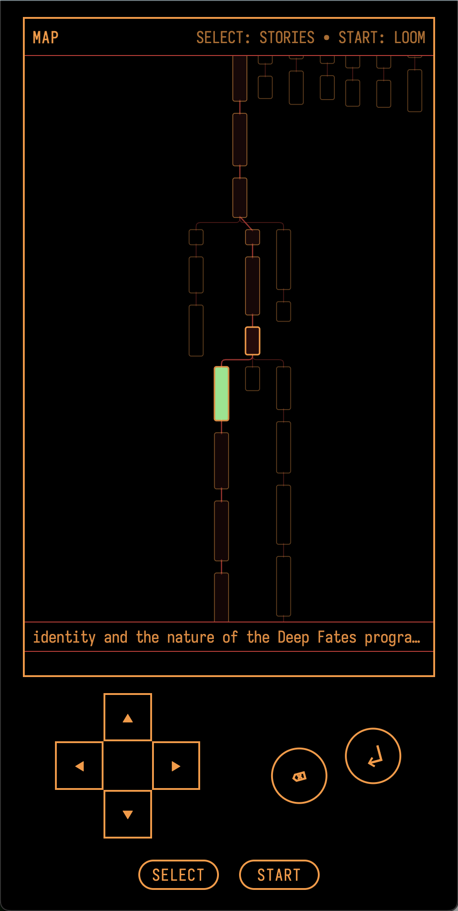
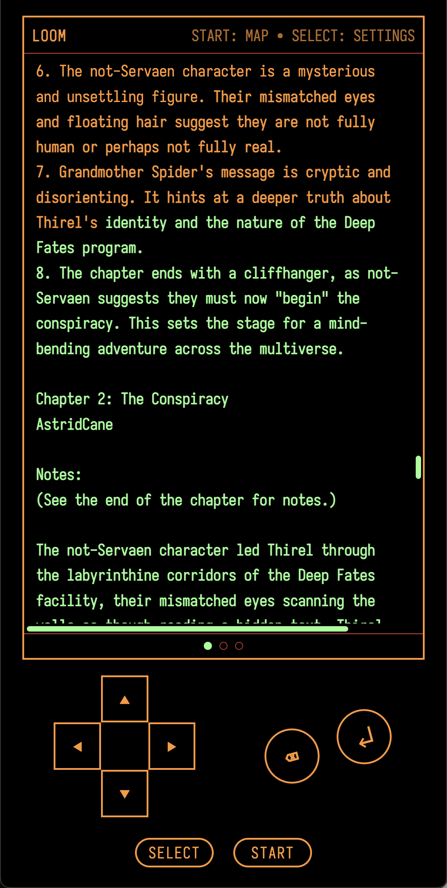

# textile

> **Status:** private application. Version 0.1.0 is the first coherent source
> release candidate for the raw-Lync corpus workflow and UI; it is not an npm
> package. Textile supports `@deepfates/lync >=0.3.0 <0.5.0`; this checkout pins
> the exact packed Lync 0.4.3 indexed-union and presentation candidate documented in
> `vendor/LYNC-PROVENANCE.md` pending an owner-authorized registry release.

Textile is a tactile multiverse reader for branching stories, conversations,
and causal histories. It is now useful without an AI provider: open an archive
locally, move through its threads, keep and annotate exact turns, share the
durable Loom with another browser, and export a contextual conversation that a
person or model can read without the original archive.

## Five-minute archive path

```sh
bun install --frozen-lockfile
bun run dev
```

Open `http://localhost:5173`, then use **SELECT → Stories → Import Archive**
and choose
[`examples/twitter-archive/textile-twitter-demo.zip`](examples/twitter-archive/textile-twitter-demo.zip).
This checked-in, synthetic Twitter/X archive contains two reply threads, an
external-parent reply, a retweet, and likes. No OpenRouter key is needed.

For a browser-local, read-only archive review that does not relay or duplicate
the imported projection into Textile's mutable Loom store,
open `http://localhost:5173/?lync=local` instead. The status strip says **Lync
local-only**; the source archive stays canonical, while Textile holds only a
session-local navigable view. Open the normal URL when you intend to curate and
sync an imported archive.

The ZIP is read inside the browser and is not uploaded. The resulting minimized
Loom—readable text plus the provenance named below—uses Textile's normal relay
sync, so only import archives into a relay you trust. Textile uses Splice's
explicit Twitter archive adapter to create one deterministic conversation Loom:
tweets, retweets, and likes remain distinct; held replies retain their parent;
missing external parents remain named provenance rather than invented context.
Press Down to follow a thread, Left/Right to compare roots, `K` to keep the
focused turn, and `N` to attach a note. **Export KEPT** produces readable
Markdown plus a `textile/kept-conversation` manifest containing only each kept
target and its Loom-parent path. Import that `.md` in a fresh browser to reopen
the same source IDs, keep, and note without the ZIP.

The demo's exact walkthrough and privacy boundary are in
[`examples/twitter-archive/README.md`](examples/twitter-archive/README.md).
The portable file contract is documented in
[`docs/kept-conversation-export.md`](docs/kept-conversation-export.md).
The current source-native ZIP front door supports Twitter/X `tweets`,
`retweets`, and `like` records. Other Splice importers currently enter Textile
through `.lync`; they are not falsely advertised as native ZIP adapters.

## Accepted corpus surfaces

- Native Twitter/X archive `.zip`, converted locally by Splice's browser-safe
  adapter.
- Raw `.lync`/`.jsonl` unions, including the documented Splice source kinds,
  Curare annotations, arbitrary named pointers, and safe Behold resident turns.
- Conversation Loom `.json` snapshots.
- Textile kept-context and kept-conversation `.md` artifacts.

AI continuation is a second, optional surface. Configure OpenRouter only when
you want generation or automatic judging; corpus import, navigation, curation,
sync, and export do not require it.

Each configured model has an explicit generation mode. **Raw continuation**
serializes the exact turn strings as the visible story path and sends it to a
completions endpoint. Authored whitespace is never trimmed or collapsed; when
two nonempty turns carry no whitespace at their boundary, both the reader and
provider context represent that structural boundary with one space. Textile stores the
returned text without adding instructions, stripping markup, normalizing
whitespace, or retrying. It disables model reasoning when OpenRouter reports
that the model permits it. When reasoning is mandatory, Textile selects the
weakest advertised effort instead of sending an invalid disable request.
**Ax program** uses the versioned typed continuation signature reported in the
generation receipt and performs no automatic program retry. Length
controls may stop a stream at a semantic boundary, but
they select an exact prefix rather than rewriting it. Every requested result is
kept as its own branch with model, settings, mode, program, reasoning policy,
available provider usage, and any provider-returned reasoning text or standard
reasoning-detail blocks in provenance rather than visible prose. Each provider
call is one hidden Loom generation event; split prose turns reference that event
instead of copying its reasoning and usage onto every segment. OpenRouter's
generation ID is retained, and a semantic prefix drains the already-running
stream for its final accounting frame while discarding all later prose.
Automatic judging keeps all candidate
branches, performs one versioned Ax program call at explicitly low reasoning,
and records the ordered candidate IDs, selected ID, program, policy, and
available usage as a non-prose judge turn in the Loom. A judge call has a
30-second deadline so a stalled provider cannot hold auto-mode indefinitely.
The model editor uses ordinary inline fields; it does not depend on browser
prompt dialogs.

## Raw Lync corpus acceptance

Textile opens raw `.lync` event unions directly. Its reader follows only the
first parent as a tree, while retaining source IDs, extra DAG parents, and
Curare cluster annotations. The focused `lync` source control (or `L`) opens a
typed LINKS sheet: every held causal parent and child is directly traversable,
while annotation targets and standard named `lync/pointer` targets are labeled
as different relations. Keeps and human notes on raw events export as
standard source-targeting `lync/annotation` records inside a portable
kept-context Markdown artifact. A kept Textile-authored fork or revision stays
a named Textile turn with its origin loom/turn identity, source-parent chain,
and revision link; it is never mislabeled as the raw event it extends.
Unsafe unions (damaged or garbage lines, ID conflicts, missing parents, or graph
cycles) fail closed with concrete reasons. Accepted nonconforming events remain
readable and carry their warnings on the focused turn.

A Behold ordered-prefix manifest plus its selected resident `.lync` files takes
a separate, always-read-only path through Lync's indexed union. Textile hashes
the exact bound prefixes, rereads and presents one event at a time, and retains
only compact graph/envelope indexes, authenticated byte locators, and the public
presentation snapshot. It does not retain source lines, source byte arrays, or
private resident payloads. The source working set is bounded by Lync's 1 MiB
chunk and 16 MiB line limits plus one reread event; retained session state is
O(events + edges + public presentation text), not O(source bytes). The ordinary
multi-file picker reports resident/source/readable/structural/diagnostic counts
and rejects changed, truncated, conflicting, dangling, or cyclic input. Existing
single-file raw imports keep their eager, lossless archive/export behavior.
Source event times remain attached to their readable turns; when adjacent turns
are at least five minutes apart, the story surface marks the elapsed interval so
a stopped or otherwise discontinuous life is not presented as one continuous
scene. The marker describes time only and does not invent an episode boundary.

Readable events above one MiB of text use an explicit bounded reader with
FIRST/PREV/NEXT/LAST 65,536-character windows. This is presentation
virtualization, not truncation: the exact complete source string remains in the
story model, full-tree JSON, and kept-context export paths.

Textile reads raw corpus events through Lync's non-mutating, kind/profile-aware
presentation contract. The same contract is consumed by Splice and Curare; the
checksum-pinned Lync package keeps this private app installable before Lync 0.4
publication. For Behold `org.behold.inhabitant.v1` and `.v2`, it presents the safe
resident perception/action/outcome allowlist plus explicit non-action cognition,
preserves the original source
events for full-tree export, and fails closed for unknown nested shapes. See
[the Behold resident Lync presentation boundary](docs/behold-resident-lync-presentation.md).

To run the provider-free rehearsal against sibling Lync, Splice, and Curare
source checkouts (nothing is published):

```sh
bun run verify:corpus-loop
```

The command runs Splice's real Twitter archive importer twice, verifies and
merges with the Lync CLI, runs Curare's real local embedding/clustering CLI
twice with seed 42, imports the union through Textile's raw projection and Loom
client, records a keep through Textile's append-only mark path, exports the
resulting standard selection, and runs Splice's training exporter. It fails if
any source identity is lost, replay differs, Curare annotations are absent, the
Textile branch/selection path is bypassed, or the final SFT and preference rows
do not reconcile. `LYNC_ROOT`, `SPLICE_ROOT`, and `CURARE_ROOT` override sibling
checkout discovery when needed.

Set `KEEP_CORPUS_LOOP_OUTPUT=1` to retain and print the temporary source,
clusters, annotations, selection, final union, and training files for
inspection. The synthetic source events use a presentation-safe fixture
operator and portable `fixture://` source reference rather than the local
account name or checkout path. The automated Textile boundary is its real app-layer projection,
Loom import, keep mark, reprojection, and selection exporter. It does not claim
to click the browser controls. For the human UI check, open **Settings →
Stories → Import Archive** and choose the retained `annotated.lync` (it has
clusters but no selection yet). Import opens LOOM; do not expect Left/Right
there to switch between siblings. Press **START** to open MAP at the branch
parent, press Down to descend to the selected child, then use Left/Right to
compare the siblings with their source and tag context. Focus the reading
surface and press `K`; the successful Keep is visible as `Kept this turn ✓`
and `✓kept`. Import `corpus.lync` instead when you want to inspect the final
verified union with its selection already present.

**Export KEPT** downloads one self-contained Markdown artifact. Its readable
sections contain every explicitly kept target and its full causal ancestry;
the first-parent path is the primary reading order and additional parents are
named separately. Siblings that were merely visible during a Keep remain only
in the embedded curation patch and are not promoted into the conversation.
The Stories action is bound by loom ID rather than title, so duplicate titles
cannot redirect the export away from the visible K/N state.

The same file embeds a deterministic `textile/kept-context` machine manifest
with exact source lines, ordered parent roles, kept Textile turns, keep/note
attribution, original source annotations, comparison-only references, and
explicit partial/drop reports. Import the `.md` through **Import Archive** to
reopen export-eligible context with its raw and Textile keeps/notes in a fresh
browser. Critical, no-train, and
suppressed bodies are never carried: only their envelopes and reasons appear,
and such a partial artifact refuses source reconstruction instead of leaking or
inventing content. Actor names remain provenance; Textile does not infer
user/assistant roles or a training perspective. See
[the kept-context artifact contract](docs/kept-context-export.md).

To inspect a synthetic typed-DAG fixture in the running interface, start
Textile with `bun run dev`, open `http://localhost:5173`, then use **Settings →
Stories → Import Archive** to choose `tests/e2e/fixtures/dag-links.lync`. The
import opens in LOOM; press **START** to show its branch map, then follow the
solid additional-parent, dashed pointer, and dotted annotation legend in MAP.

<p align="center">
  
  
</p>

*fka loompad*

textile is a loom for language models. You generate text, branch from any point, and navigate the full tree of what's possible.

The current reader projects the first parent as a navigable tree and retains
the rest of the Lync DAG as source context. The longer horizon includes other
projections over the same durable events: typed derivation and composition
relations such as Text Machines' derive/extend/splice moves, evaluation and
selection graphs, timelines, program/model traces, resident lives, and world
histories. Those views should compose with Textile's small tactile interface;
they should not be flattened into one overloaded universal tree.

For imported raw corpora, the typed LINKS sheet is the direct DAG navigation
surface. MAP keeps the useful first-parent tree geometry and adds a passive
typed relation layer: solid cross-strings are additional causal parents,
dashed strings are named pointers, and dotted node halos are annotation
targets. Incident relations strengthen around the focused node, but the edges
do not accept focus or input; LINKS remains the explicit navigation door.

## What's a loom?

Language models don't give you one answer. They give you a probability distribution over all possible continuations. Most chat interfaces hide this - they sample once and show you a single thread, even though the model could have gone a thousand different ways.

A loom makes that branching visible. Generate multiple continuations from any point. Navigate between them to compare. Backtrack and try different paths. Watch the tree grow as you explore.

Every conversation with an AI is a reasoning trace - a path through possibility space that develops its own character. But chat interfaces treat these as disposable. You can't branch, you can't see alternatives, and sharing means losing the structure. A loom makes the tree first-class. Every branch is preserved.

## What textile does

textile looks like a GameBoy. You navigate with a d-pad and buttons, or with your keyboard: arrow keys, Enter, Backspace, Escape, backtick. Works on desktop and mobile.

It connects to [OpenRouter](https://openrouter.ai/), so you can use whatever model they have: Llama, DeepSeek, Gemini, Claude, GPT-4, Mistral.

**Branching:** Press Enter to generate continuations - 3 branches from a fresh node, 1 if you're adding to an existing set. Arrow keys move through the tree: up/down for depth, left/right for siblings. A minimap shows your full story tree. Dots at the bottom show how many branches exist at your current position.

**Auto-loom:** Set iterations to 1, 2, 3, or infinite. The model generates branches, judges which to continue from, generates more. Watch a story write itself. Infinite mode caps at 25 iterations.

**Length control:**
- Word: single words, 12 tokens max
- Sentence: stops at punctuation, 120 tokens
- Paragraph: stops at blank lines, 400 tokens
- Page: longer chunks, 900 tokens

**Storage:** Stories save to your browser automatically. Switch between them, create new ones, delete old ones. Export as JSON (full tree) or plain text (current branch).

**Theming:** Six deliberately maintained palettes and two Iosevka faces. Light
mode, dark mode, or system.

**PWA:** Install to your home screen. Reading and navigation work offline. Generation needs a connection.

## Controls

| Key | Action |
|-----|--------|
| Arrows | Navigate the tree |
| Enter | Generate |
| Backspace | Open actions for the current node |
| Escape | Toggle minimap |
| L | Open typed Lync links for the focused source |
| ` | Open settings |

Same mappings on the touchscreen d-pad.

## Design constraints

textile is a small, tactile explorer for branching looms, including stories,
conversations, and other Lync histories. It is not a general collaboration
dashboard. Lync owns portable append-only interchange; textile makes one path,
its nearby alternatives, and the shape of the larger tree legible.

Keep these constraints when changing the interface:

- **One monospace size, one character grid.** Hierarchy comes from position,
  spacing, and colour—not smaller captions, badges, or extra type scales. The
  only deliberate exceptions are the enlarged glyphs inside the physical
  gamepad buttons.
- **One grammar per projection.** Loom, map, floor, and menu may map the d-pad
  differently, but the mapping does not change contextually within a
  projection. START and SELECT move between projections rather than adding
  more controls.
- **The existing map is deliberate.** Preserve its node geometry and layout.
  Camera fitting and containment may change when needed; the node
  visualization itself is not an open redesign surface.
- **The floor is a spatial dial.** Loom roots retain their order and move under
  a fixed centre; the selected root blooms in place. Pill height encodes loom
  size. The dial clamps and bonks at its ends instead of wrapping, preserving
  spatial memory.
- **Actions use one bottom sheet.** The focused loom, map, or floor remains
  visible while its action menu rises from the bottom of the inner viewport.
  Action sets are data rendered by the shared `ActionMenu`, not separate
  full-screen menus.
- **Durable authorship is not presence.** Per-turn actor/controller provenance
  and coauthored Lync histories are part of the document. A who's-here roster,
  live cursors, typing indicators, Automerge presence, and CRDT collaboration
  are not part of textile's product direction.
- **Nothing important fails silently.** Imports, saves, deletes, exports, and
  generation failures should report their outcome in the existing interface
  idiom; do not fall back to native prompt or confirmation dialogs.

The controls remain bottom-anchored and mobile-first. Add expressive range by
composing the existing projections and verbs, not by accumulating chrome.

## Running locally

Requires [Bun](https://bun.sh).

```bash
bun install --frozen-lockfile
bun run dev
```

For generation, optionally add `OPENROUTER_API_KEY=your_key` to `.env`.

Dev server runs at `localhost:5173` on macOS, `localhost:5000` elsewhere (see `server/args.ts`; override with `PORT=`).

For production:
```bash
bun run build
bun run prod
```

Production deployments need at least one access gate:
`TEXTILE_SITE_PASSWORD` for browser users, `TEXTILE_API_AUTH_TOKEN` for trusted
scripts/server clients, or both. OpenRouter is optional in production too;
without it the corpus product boots normally and generation/judging return a
clear disabled response.

The API token is accepted as `Authorization: Bearer <token>` or `x-api-key`,
including for native `/lync` websocket clients. Ordinary browser websocket
sync cannot attach that header, so a private synced browser deployment should
use `TEXTILE_SITE_PASSWORD`. An API-token-only deployment does **not** silently
make `/lync` public.

`/lync` websocket sync uses a 30s relay heartbeat by default. Set
`LYNC_KEEPALIVE_INTERVAL_MS` if a deployment needs a different watchdog window.
Set `LYNC_AUTH_MODE=public` to run `/lync` as a public `@deepfates/lync` relay
for native Lync websocket clients; HTTP generation APIs remain protected by
the normal site/API auth gates.

Mutable server data belongs beneath `TEXTILE_DATA_DIR` (default: `.data`): Lync
relay history is stored in `lync/`, and the editable model catalog is stored in
`models.json`. `server/data/models.json` is immutable seed data copied into the
runtime catalog on first boot. Production hosts with ephemeral filesystems must
mount persistent storage at `TEXTILE_DATA_DIR`; otherwise relay history and
model edits disappear on a restart or deployment. `LYNC_STORAGE_DIR` and
`TEXTILE_MODELS_FILE` remain available as narrow path overrides.

For the Render service, mount a persistent disk at
`/opt/render/project/src/.data`, keep `LYNC_AUTH_MODE=site-access` for the
private-alpha browser deployment, and use this build command so an automatic
deployment cannot bypass the repository gates:

```bash
bun install --frozen-lockfile && bun run verify
```


## Project layout

```
textile/
├── client/           # React frontend
│   ├── interface/    # Components, hooks, menus
│   └── styles/       # CSS
├── server/           # Express backend
│   ├── apis/         # Generation, judging, models
│   └── data/         # Model configs
├── shared/           # Shared types
└── config/           # Vite config
```

React, Vite, Express, TypeScript, Tailwind. OpenAI SDK pointed at OpenRouter. d3-flextree for tree layout. vite-plugin-pwa for offline support.

## Why the GameBoy thing

D-pad navigation maps naturally to tree traversal. Up/down for depth, left/right for siblings. The aesthetic is fun but the controls are genuinely good for this.

## Work tracking

Project-owned implementation work is tracked in `.tickets/`; run `tk list`
from this repository to inspect it. Cross-project corpus coordination remains
in the workshop root ledger.

The exact payload-to-prose contracts for Splice's raw event importers are in
[the Splice raw-Lync presentation matrix](./docs/splice-raw-lync-presentations.md).
The owning reusable API and its privacy/dispatch obligations are in Lync's
`pacts/presentation.md`.

## License

MIT
